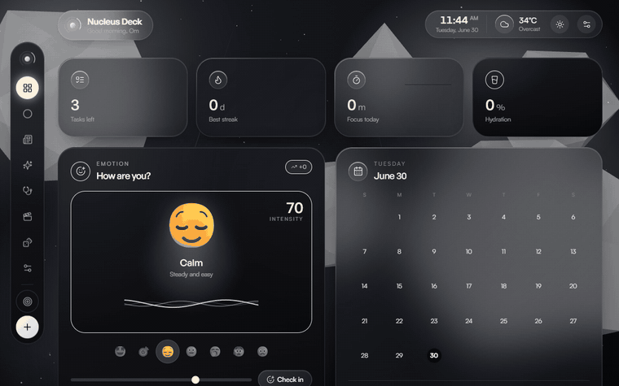
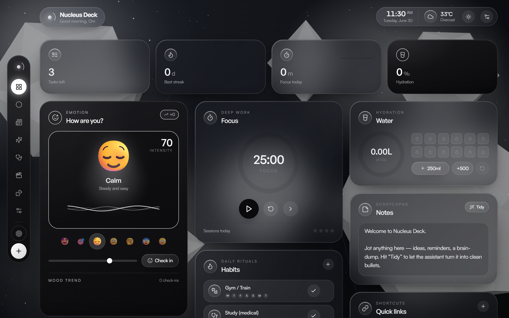
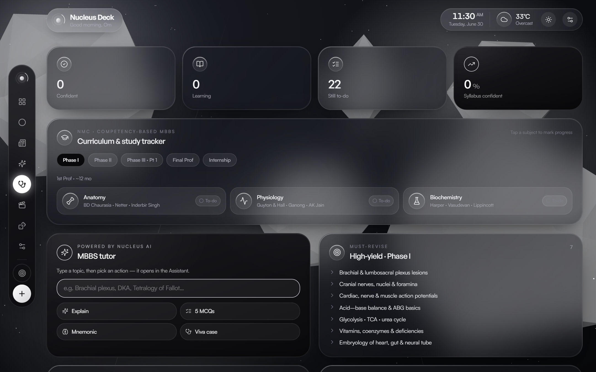
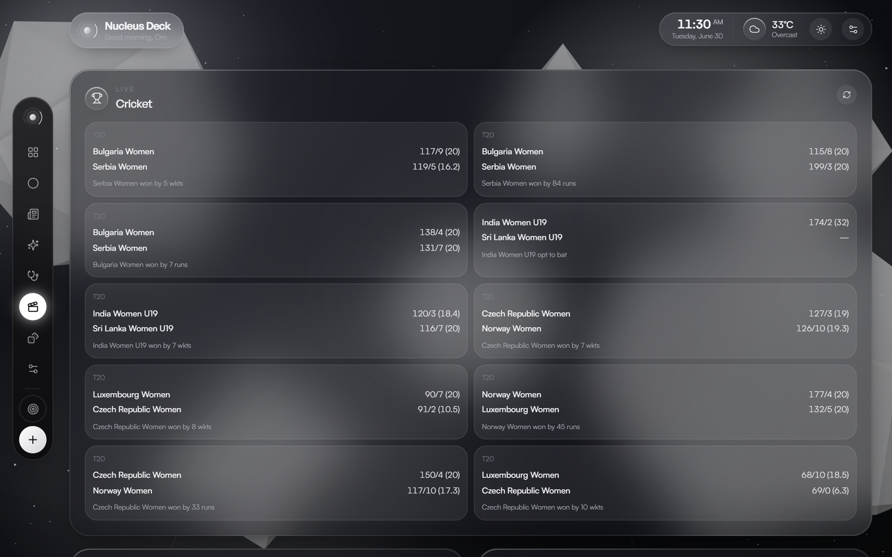
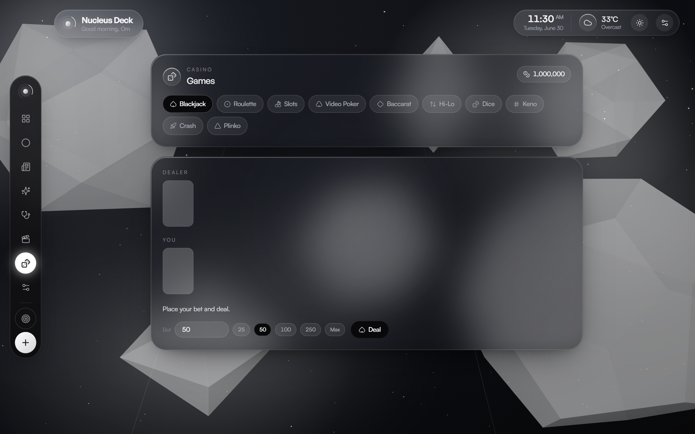
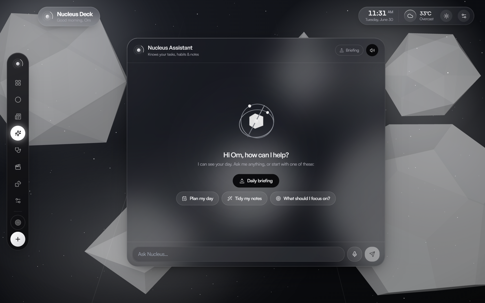

# ◎ Nucleus Deck

A personal **liquid-glass life dashboard** — built for Om Devi Shankar. It doesn't look
like a website; it feels like a living 3D glass object floating in space. Calm, fast,
premium, and genuinely functional — your day, your media, your markets, an AI that
**talks to you**, and a full casino, all running **locally** on your machine.

Strictly monochrome (black → charcoal → silver → white), Apple/visionOS-inspired,
spring-physics motion, mouse-driven parallax and lighting, and a WebGL crystal background.


[](LICENSE)
[](https://github.com/crusheR-058/nucleus-deck/actions/workflows/ci.yml)

---

## 📸 Screenshots



| Home | 🩺 MBBS hub |
|---|---|
|  |  |
| ▶ Play — markets, cricket & movies | 🎰 Casino (1,000,000 chips) |
|  |  |
| 🗣️ Voice AI assistant + Daily Briefing | |
|  | |

---

## ✨ What's inside

**Your day (Home)**
- **Tasks** — add / complete / delete, priorities, "how many left", one-tap **Plan my day** (AI)
- **Habits** — daily rituals with 7-day strips and streak counts
- **Notes** — a quick scratchpad with an AI **Tidy** button
- **Focus** — a Pomodoro timer (25 / 5) with a glass progress ring
- **Mood** — a living emotion card: 3D emoji, animated aura, waveform, intensity, and trend
- **Water** — hydration tracker with a radial goal ring
- **Quick links · Agenda** — glass bookmarks and a mini month calendar + what's next

**🗣️ Voice AI Assistant**
- Context-aware chat that can see your tasks, habits and notes
- **Speaks its replies aloud** and takes **voice input** via the mic (browser Web Speech API)
- One-tap **spoken Daily Briefing** — weather, today's priorities, hydration and headlines, read to you
- Plan my day · Tidy notes · Summarize articles · free chat

**🩺 MBBS hub** — NMC competency-based curriculum by phase, a persistent study tracker, normal lab values, vitals & clinical formulas, mnemonics, an AI tutor, and resource links.

**▶ Play** — live **crypto** (CoinGecko) & **stocks/indices** (Yahoo Finance), **movies & TV** (TVmaze + iTunes) with a watchlist, and **live cricket** scores (cricketdata.org). Keyless where possible.

**🎰 Games** — a full monochrome casino: **Blackjack, Roulette (3D wheel), Slots, Video Poker, Baccarat, Hi-Lo, Dice, Keno, Crash, Plinko** — with a shared, persistent chip bankroll and manual bet entry.

**🎬 Media Studio (YouTube)** — in-app search (YouTube Data API v3) and download to MP4 / MP3 / M4A via **yt-dlp** (+ ffmpeg), with live progress and history. For content you're allowed to download.

**📰 Tech News** — live feed from major sources with filtering, auto-refresh, and an AI **Summarize** button.

**🎛️ Extras** — **Focus mode** (strips the deck to MBBS + Assistant), light/dark/auto themes, reduced-motion & WebGL toggles, and shareable **deep links** (`?view=games`).

---

## 🧱 Tech stack

Next.js 14 (App Router) · TypeScript · Tailwind CSS · Framer Motion · React Three Fiber + Drei (Three.js) ·
Zustand (localStorage persistence) · Lucide icons · **OpenAI-compatible AI** (Groq by default) ·
Web Speech API (voice) · rss-parser · yt-dlp + ffmpeg.

---

## 🚀 Setup

### 1. Install dependencies
```bash
npm install
```

### 2. Add your keys
```bash
cp .env.example .env.local            # macOS / Linux
# Copy-Item .env.example .env.local   # Windows PowerShell
```

| Key | Where to get it | Powers |
|---|---|---|
| `AI_API_KEY` | [console.groq.com](https://console.groq.com) → API Keys (free) | Assistant, Daily briefing, Plan/Tidy/Summarize |
| `YOUTUBE_API_KEY` | [Google Cloud Console](https://console.cloud.google.com) → YouTube Data API v3 | Studio search |
| `NEWS_API_KEY` | [newsapi.org](https://newsapi.org/register) (optional) | News photos/sections (falls back to Google News) |
| `CRICKET_API_KEY` | [cricketdata.org](https://cricketdata.org) (free) | Live cricket scores on Play |
| `OMDB_API_KEY` | [omdbapi.com](https://www.omdbapi.com/apikey.aspx) (free, optional) | Movie search on Play (TV works without it) |

> **No keys needed** for weather, crypto, stocks, TV listings, and all 10 casino games.
> The AI is OpenAI-compatible — switch providers with `AI_BASE_URL` / `AI_MODEL` (Groq `llama-3.3-70b` by default).

### 3. (Optional) yt-dlp + ffmpeg — only for the downloader
```powershell
winget install yt-dlp.yt-dlp ; winget install Gyan.FFmpeg   # Windows
# brew install yt-dlp ffmpeg                                  # macOS
```
If they aren't on your `PATH`, set `YTDLP_PATH` / `FFMPEG_PATH` in `.env.local`.

### 4. Check & run
```bash
npm run doctor      # reports which keys / binaries are detected
npm run dev         # http://localhost:3000
npm run build && npm run start   # production
```

---

## 🗄️ Where your data lives

- **Everything you create** (tasks, habits, notes, mood, water, chat, chips, watchlist, settings) → your browser's `localStorage` (key `nucleus-deck-v1`). Nothing leaves your machine. Reset in **Settings → Reset all data**.
- **Downloaded files** → `downloads/` · **download history** → `data/downloads.json`.
- **API keys** → `.env.local`, read **server-side only**, never shipped to the browser.

`downloads/`, `data/`, and `.env.local` are git-ignored.

---

## 🩺 Troubleshooting

- **Assistant errors / no voice replies** → check `AI_API_KEY`; restart after editing `.env.local`. Voice STT (mic) needs Chrome/Edge.
- **Cricket shows a setup hint** → add `CRICKET_API_KEY`; movie search needs `OMDB_API_KEY` (TV works without it).
- **YouTube search "not configured"** → add `YOUTUBE_API_KEY` and restart.
- **Downloads fail** → `npm run doctor`; install yt-dlp (+ ffmpeg for MP3 / 1080p+).
- **Weather blank** → needs internet (Open-Meteo, keyless).

---

## 📄 License

[MIT](LICENSE) © 2026 Om Devi Shankar

Built as a calm, premium home base. Enjoy your mornings. ◎
